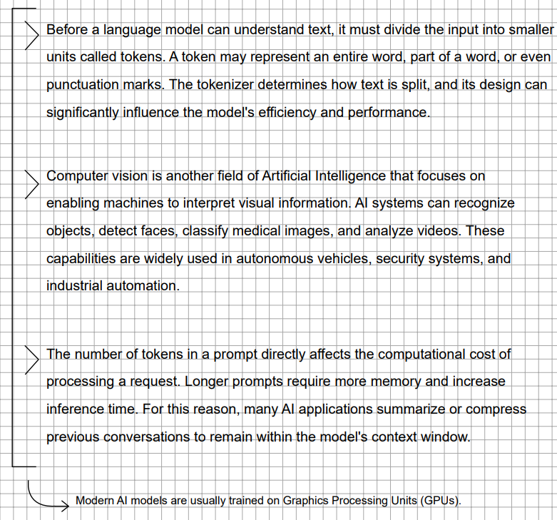
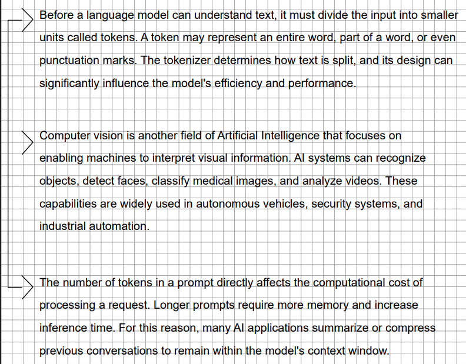

As lessons become more complex, information does not always follow a perfect order. The following tools will help you link and group ideas together when ordinary writing is not enough.
# Superblock

We often jot down several paragraphs in a row and realise that the truly important idea isn’t in any one paragraph in particular, but in **the collection of them all**.

To ensure we don’t lose that context, Gray Notation formalises something we tend to do instinctively: grouping with curly brackets.

A **Superblock** is the visual grouping of two or more consecutive blocks. Its main function is to allow you to draw a conclusion, a summary or a general comment from that group, assigning it its own level of importance (using arrows, circles, etc.).

# Relationships

**The Problem:** Imagine you’re in class taking notes. The teacher moves on to a new topic, but suddenly remembers a detail and goes back to explain something from the previous topic. In a digital document, it’s easy to press ‘Enter’ and insert text, but on paper this often ruins our notes, forcing us to do tedious mental calculations or fill the margins with confusing arrows.

**The Solution:** Gray Notation solves this problem with physical formatting by using **Relations**.

A Relation is a simple connecting line that links a new block of text to a previous one that was cut off by other information. It’s a way of telling your brain: “this paragraph down here is a direct continuation of what I wrote above”.

Lines are ideal for linking ideas that are relatively close together on the same page. However, if the related information is spread out over a large area (for example, across several pages), drawing long lines would make your notes look chaotic and untidy.

In cases where the topic is spread out over a long period of time, we’ll make use of **Groups**.

