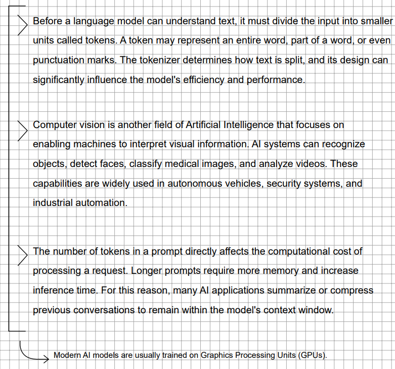
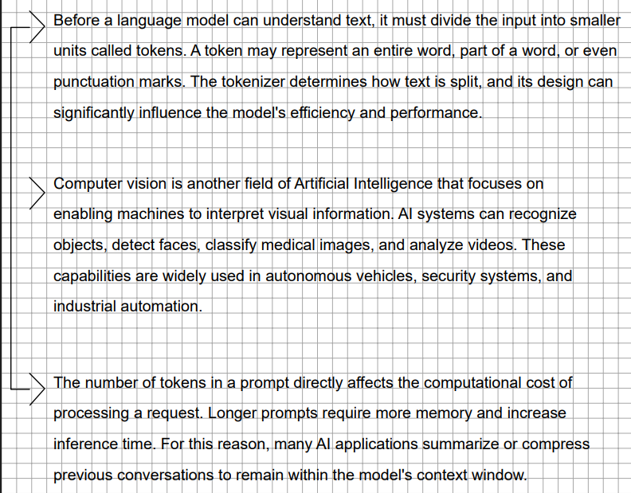
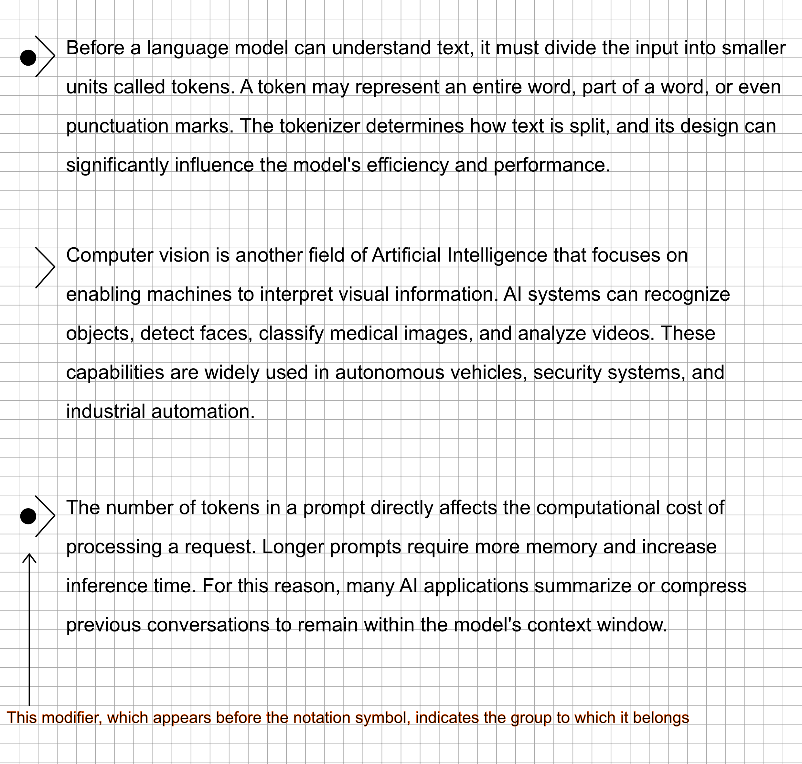
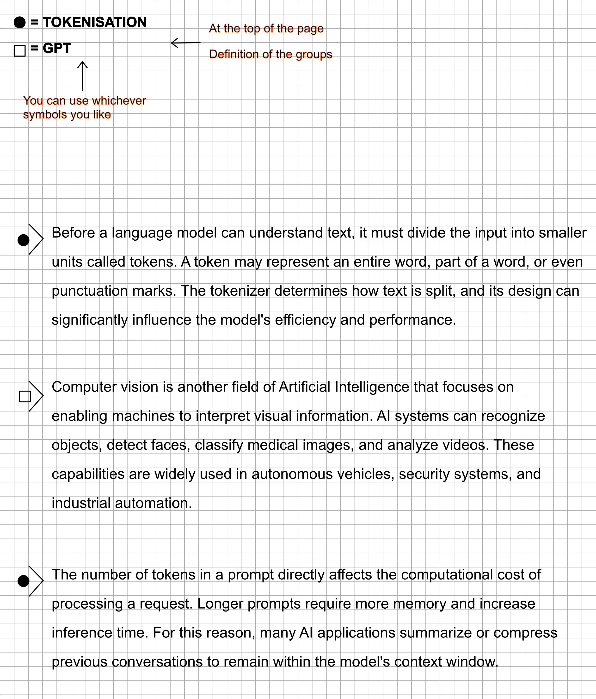

As lessons become more complex, information does not always follow a perfect order. The following tools will help you link and group ideas together when ordinary writing is not enough.
# Superblock

We often jot down several paragraphs in a row and realise that the truly important idea isn’t in any one paragraph in particular, but in **the collection of them all**.

To ensure we don’t lose that context, Gray Notation formalises something we tend to do instinctively: grouping with curly brackets.

A **Superblock** is the visual grouping of two or more consecutive blocks. Its main function is to allow you to draw a conclusion, a summary or a general comment from that group, assigning it its own level of importance (using arrows, circles, etc.).

# Relationships

**The Problem:** Imagine you’re in class taking notes. The teacher moves on to a new topic, but suddenly remembers a detail and goes back to explain something from the previous topic. In a digital document, it’s easy to press ‘Enter’ and insert text, but on paper this often ruins our notes, forcing us to do tedious mental calculations or fill the margins with confusing arrows.

**The Solution:** Gray Notation solves this problem with physical formatting by using **Relations**.

A Relation is a simple connecting line that links a new block of text to a previous one that was cut off by other information. It’s a way of telling your brain: “this paragraph down here is a direct continuation of what I wrote above”.

Lines are ideal for linking ideas that are relatively close together on the same page. However, if the related information is spread out over a large area (for example, across several pages), drawing long lines would make your notes look chaotic and untidy.

In cases where the topic is spread out over a long period of time, we’ll make use of **Groups**.

# Groups

As we saw in the previous section, ‘Relations’ lines have a practical limit. If the concepts you need to connect are separated by many paragraphs, or even across different pages, drawing lines would make your notes illegible. This is where Groups come in.
  
A Group is a visual labelling system. It serves to bring together scattered blocks of information that belong to the same topic.
 
The aim is to allow you to read in a ‘filtered’ way: thanks to groups, you can quickly scan your pages and read only the blocks that share the same symbol, automatically and conveniently ignoring the rest of the information.

  

> [!tip] Customise your labels
> In the examples, we usually use symbols (modifiers) such as circles or squares, but **you are in charge of your own system**. You can use triangles, diamonds, letters or any symbol that you find quick to draw. Think of them as ‘blank labels’ ready to be used.

## Defining Groups

During a long lesson, or if you’re reviewing your notes several weeks later, it’s very easy for your brain to forget which topic the ‘square’ represented and which the ‘circle’ did.
  
To avoid this confusion, Gray Notation introduces the concept of **Declaration**. It works exactly like a map key (or like declaring variables, if you know anything about programming).

It involves explicitly noting, in a small box, what each symbol means for that specific study session.

> [!info] Best Practice for Placement
> Although you can place your declaration anywhere, my personal recommendation is to put it **in the top left-hand corner of the page**. This way, it acts as an immediate visual index every time you turn the page.

  

