# Fundamental Principles of Reading

Reading in Gray Notation follows a logical structure designed to prioritise information in a visual and intuitive way. It is based on two key concepts: the **Block** and the **Notation Symbol**.

## 1. The Block: The Unit of Information

A **Block** is the fundamental unit of content in Gray Notation. It can be a sentence, a paragraph or any body of text representing a single idea. The entire system is organised and read through the relationships between these Blocks.

Nesting one Block beneath another indicates a relationship of sub-idea or elaboration, allowing thematic hierarchies to be created naturally.

## 2. The Notation Symbol: The Reading Guide

Each Block is preceded by a **Notation Symbol**. The function of this symbol is to assign a **meaning and a priority** to the Block that follows it.

These symbols are the driving force behind the system, as they transform a linear reading (from top to bottom) into a **hierarchical reading**, where attention is directed first to the most important ideas, regardless of their position on the page.

> [!important]
> The notation used in Gray Notation is recursive. This means that **absolutely all symbols can be used within nested blocks**, whilst retaining their original meaning and level of importance.

## Basic Symbols

The key symbols of the system are set out below, together with practical examples of their use.

> [!note] 
> 
> Note on visual representation  
> 
> For illustrative purposes, the images in this manual simulate the layout of an **A4-sized squared notebook**. The aim is to accurately demonstrate how spacing and the layout of symbols are managed when taking actual handwritten notes.

### Arrow

This is the fundamental symbol of Gray Notation. Its function is to identify a block unambiguously.

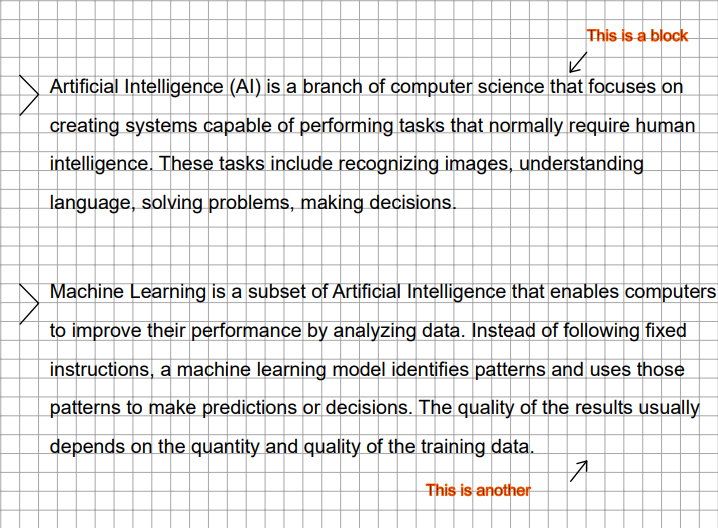

Example with nesting

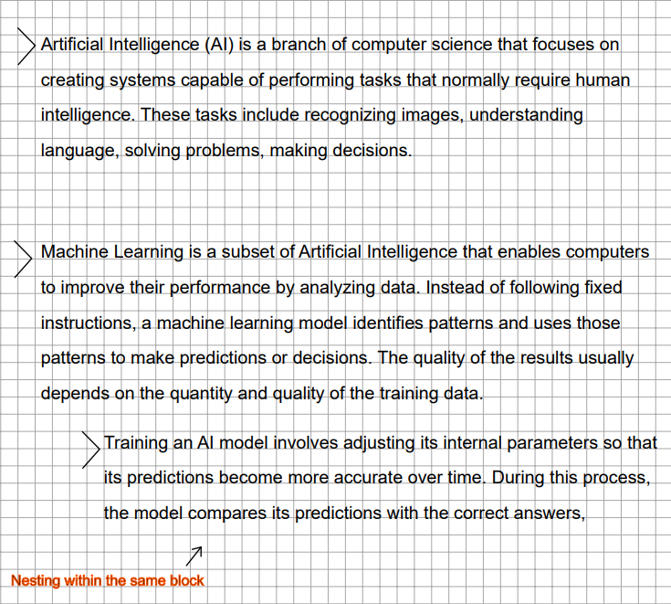

### Circle

This is used to highlight that a block contains key ideas. It indicates that the information is relevant and should be prioritised during revision sessions.

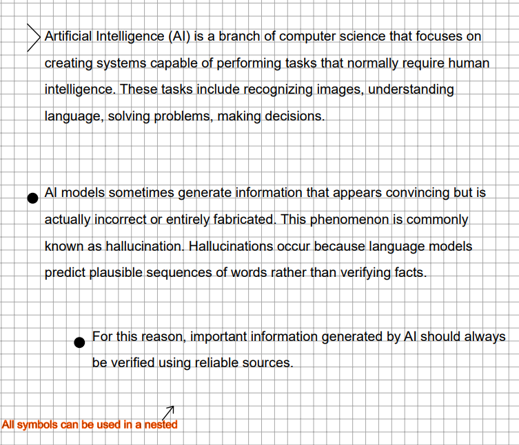

### Double arrow

This is used to identify **information that is critical or of greater importance than that highlighted with the circle symbol**. It indicates that the section contains top-priority information that requires immediate and mandatory attention when studying.

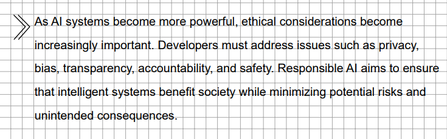

> [!note]
> You can chain together multiple darts to create custom levels of importance and prioritise a specific block over those with double darts.

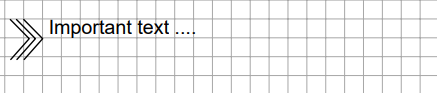

### Concept

This is used to indicate that the information in a block relates to a concept, definition or quotation.

It is used to indicate that the information in the block corresponds to an explicit definition of an idea or concept, a glossary of terms or an important direct quotation.

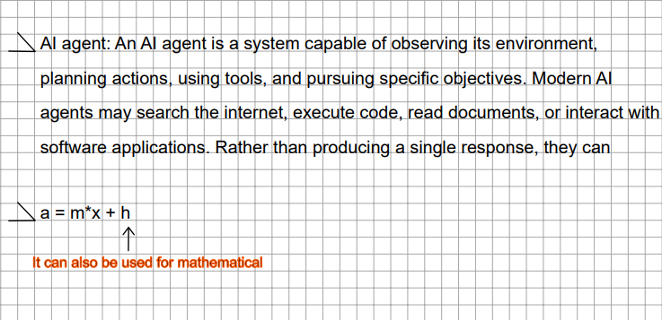

> [!note]
> It also has a version used to emphasise the importance of a definition.

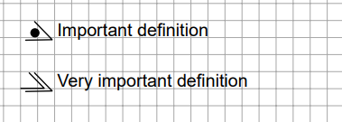

### List

Allows you to break down and organise multiple items within a single main block.

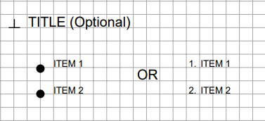

> [!warning]
> The symbols used for the list bullets are left to the individual user’s interpretation and visual preference.

## Hierarchy of importance

Once you have understood the basic symbols, it is vital to establish their **order of precedence**.

The main aim of Gray Notation is to transform the way you review material: to move from a linear and cumbersome reading process to a **hierarchical and efficient one**, where your eyes instinctively jump to the most important concepts.

The reading order, from lowest to highest priority, is as follows:

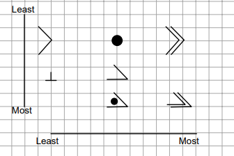

## Comments

These are used to expand on or supplement the information in a block.

Comments are visual extensions that serve to expand on, supplement, clarify or add personal notes to the information in a main block, without interrupting the flow of the original text.

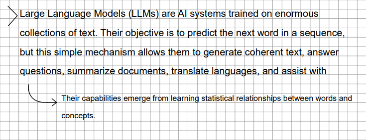

> [!note]
> Comments can be nested within other comments (sub-comments).

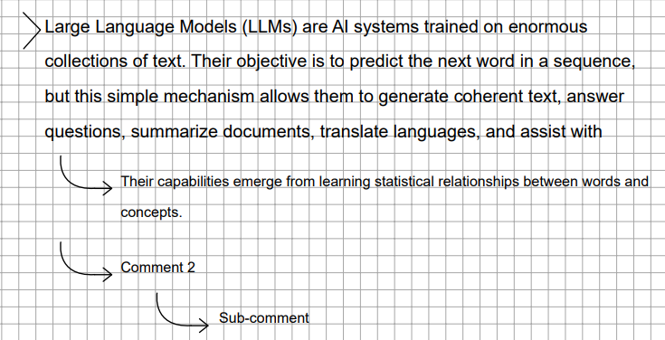

> [!note]
> You can use the same symbols (arrow, circle, etc.) as for normal blocks to indicate the relevance of the note you have added.

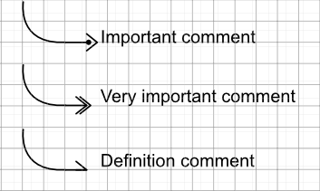
