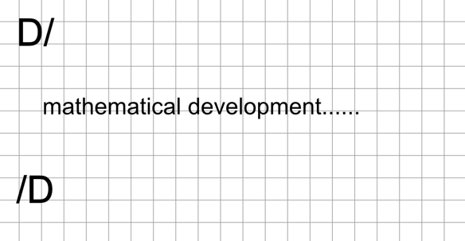
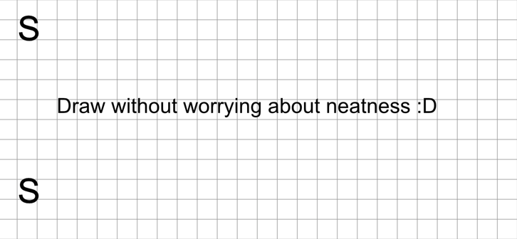

So far, we have seen how Gray Notation uses symbols to organise information at the ‘micro’ level (block by block). However, for a notebook to be truly legible, we also need to organise the information at the ‘macro’ level: **the page layout**.

This section details visual conventions for separating large thematic blocks and establishing heading hierarchies using only your pen, without the need for highlighters, colours or excessively large letters.

# Hierarchy of Headings

To visually distinguish a main topic from a subtopic, Gray Notation proposes a system of progressive underlining. This allows the eye to quickly identify the document’s structure whilst skimming through the pages.

> [!tip]
> 
> Maintaining consistent spacing (for example, always leaving a blank line or two boxes before and after a Heading 1 and 2) will greatly enhance the visual impact of this hierarchy.

# Section Separators 

During a lesson, it is common for there to be sudden changes in topic, or for one lesson to end and the next to begin in the middle of the same page.

To prevent information from different contexts from becoming visually mixed up, we use the **Section Separator**.

This involves drawing a horizontal **dashed or dotted line** (- - - - -) that spans part or all of the width of the writing area.

# Mathematical Development Section

Long formulas, step-by-step calculations and proofs of theorems can disrupt the visual flow of theoretical notes.

Explicitly designating a Mathematical Development Section allows you to group all procedural content (numbers and equations) separately from the conceptual content (the text explaining those equations).

# Free-form Whiteboard

By drawing a box on your sheet and labelling it ‘Free-form Whiteboard’, you’re giving yourself explicit permission to be messy in that specific area, without feeling that you’ve ruined the overall look of your notes.

