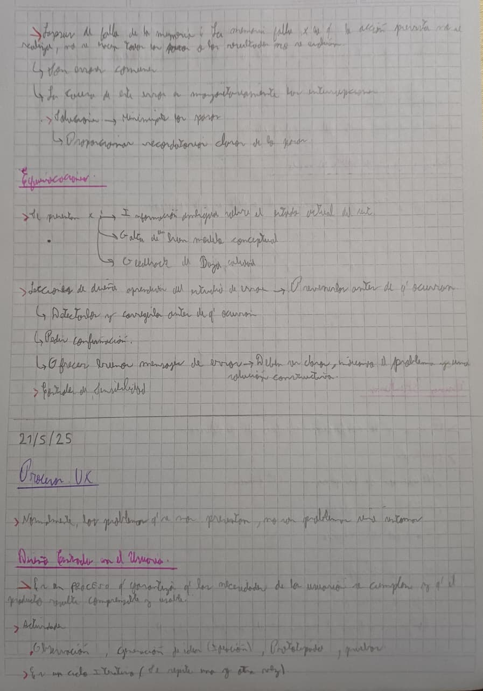
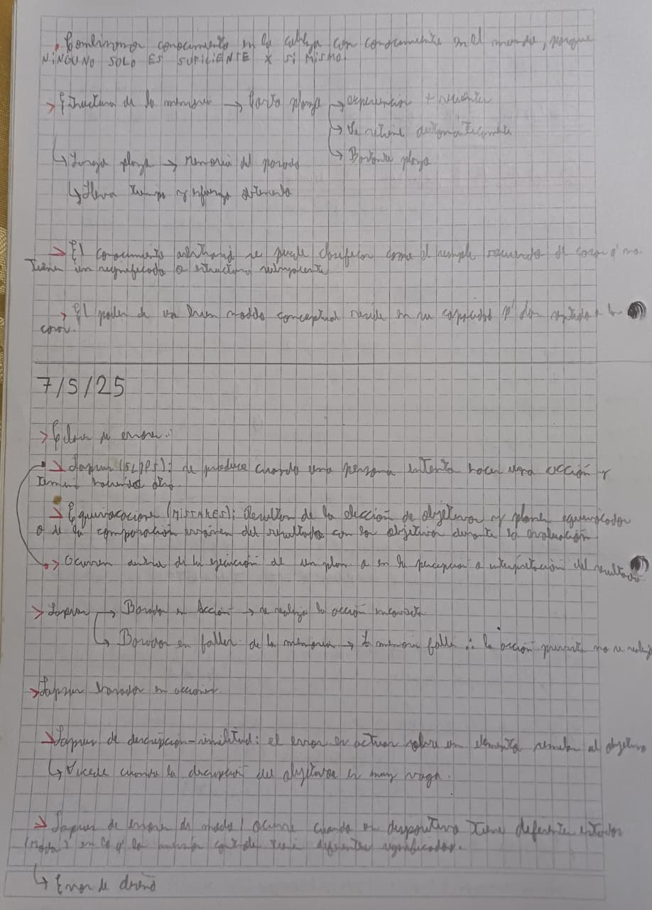
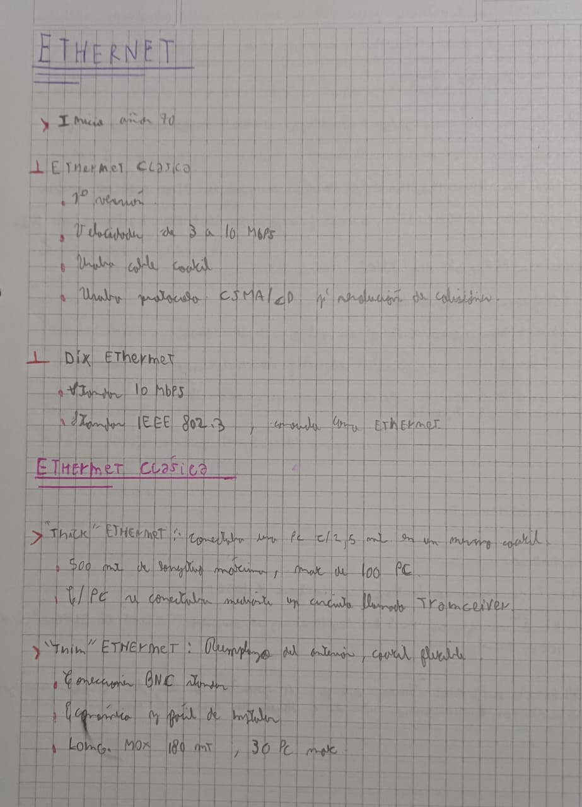

Here you’ll find examples of Gray Notation in practice. These are notes from my university studies, so don’t pay too much attention to the content, and please excuse the messy handwriting :D

---

---

---

