# Principios Fundamentales de Lectura
---

Gray Notation organiza la información como una estructura visual que permite leer primero lo importante y luego el detalle. Su base está en dos conceptos fundamentales: el **Bloque** y el **Símbolo de Notación**.

## 1. El Bloque: La Unidad de Información

Un **Bloque** es la unidad mínima de contenido en Gray Notation. Puede ser una frase, un párrafo o cualquier conjunto de texto que represente una idea singular. La lectura del sistema se construye a partir de la relación entre bloques.

Cuando un bloque se anida dentro de otro, se establece una relación de subordinación o elaboración. Esto permite crear jerarquías conceptuales sin perder el contexto de la idea principal.

### Regla de uso

- Cada bloque contiene una idea principal o una unidad de sentido.
- Un bloque puede incluir varios elementos, pero debe mantenerse como una idea clara.
- La relación entre bloques define la prioridad visual y la estructura de lectura.

## 2. El Símbolo de Notación: La Guía de Lectura

Cada bloque va precedido por un **Símbolo de Notación**. Su función es asignar un significado y un nivel de prioridad al contenido que le sigue.

Esto convierte una lectura lineal en una **lectura jerárquica**, donde la vista se dirige primero a las ideas más relevantes, sin importar su posición exacta en la página.

> [!important]
> La simbología de Gray Notation es recursiva. Esto significa que **todos los símbolos pueden utilizarse dentro de bloques anidados**, manteniendo el mismo significado y grado de relevancia original.

## Símbolos Básicos

A continuación se describen los símbolos fundamentales del sistema y su uso práctico.

> [!note]
> Nota sobre la representación visual
>
> Para fines ilustrativos, las imágenes de este manual simulan un **cuaderno cuadriculado de tamaño A4**. Esto permite mostrar de forma clara el manejo del espaciado y la distribución visual de los símbolos en apuntes físicos reales.

### Dardo
---
Es el símbolo base de Gray Notation. Su función es identificar un bloque de manera inequívoca.

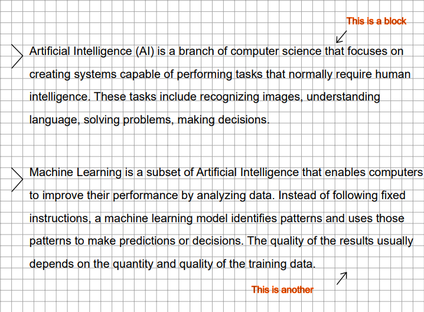

Cuando un bloque está precedido por un dardo, se entiende como la unidad principal del conjunto de información.

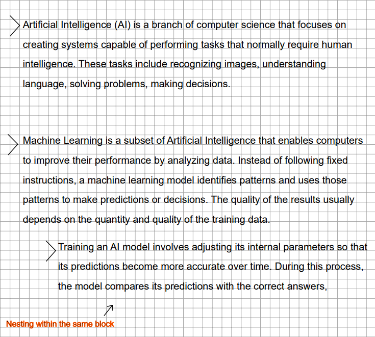

### Círculo
---
Se utiliza para destacar un bloque con contenido clave. Indica que la información es relevante y debe priorizarse durante la revisión.

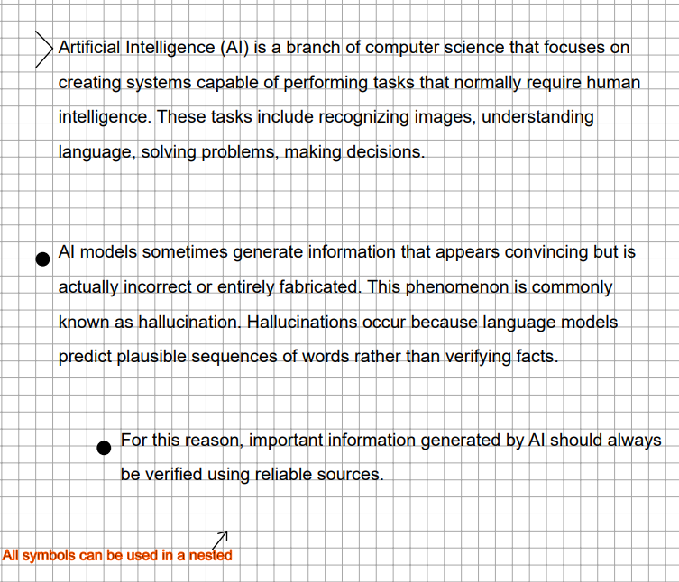

### Dardo doble
---
Se emplea para identificar **información crítica o de mayor importancia que la marcada con un círculo**. Señala un nivel de prioridad superior y exige atención inmediata durante el estudio.

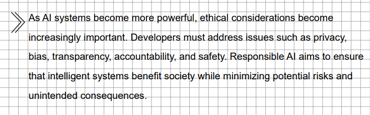

> [!note]
> Es posible concatenar varios dardos para crear niveles de importancia personalizados y reforzar la prioridad de un bloque específico por encima de otros que ya tienen dardos dobles.

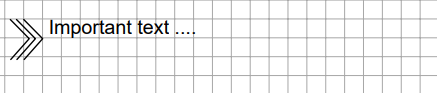

### Concepto
---
Se usa para indicar que el contenido de un bloque corresponde a un concepto, una definición, una cita o un término clave.

Su propósito es distinguir la explicación teórica o declarativa del resto de la información.

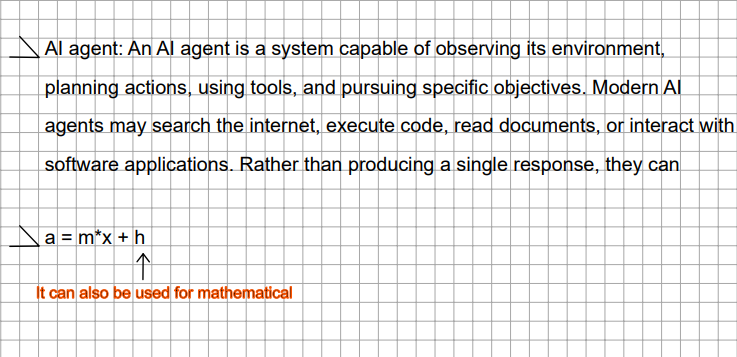

> [!note]
> También existe una variante que refuerza la importancia de una definición.

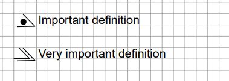

### Lista
---
Permite desglosar y organizar varios elementos dentro de un mismo bloque principal.

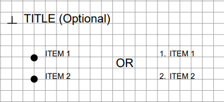

> [!warning]
> Los símbolos utilizados para las viñetas de la lista quedan a libre elección del usuario, según su criterio visual y su gusto personal.

## Jerarquía de Importancia

Una vez comprendidos los símbolos básicos, es necesario establecer su **orden de precedencia**.

El propósito principal de Gray Notation es transformar la revisión de apuntes, de una lectura lineal y poco eficiente a una **lectura jerárquica y rápida**, donde la vista salta intuitivamente hacia las ideas más relevantes.

El orden de lectura, de menor a mayor prioridad, es el siguiente:

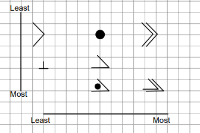

## Comentarios

Los comentarios sirven para ampliar, aclarar o complementar la información de un bloque sin interrumpir el flujo principal del texto.

Se utilizan como extensiones visuales que permiten añadir notas personales, aclaraciones o matices sin romper la estructura del contenido original.

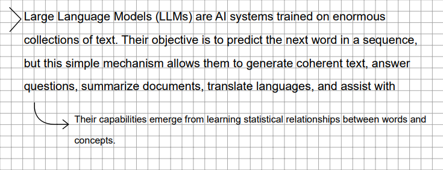

> [!note]
> Los comentarios pueden anidarse dentro de otros comentarios, creando sub-comentarios.

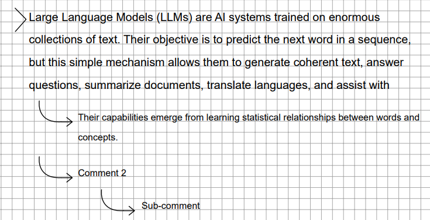

> [!note]
> También pueden emplear la misma simbología de prioridad que los bloques principales para indicar la relevancia de la nota añadida.

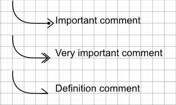

## Siguientes Temas
---

- [Conceptos Avanzados](Conceptos-Avanzados.md)
- [Estructura y Formato](Estructura-y-Formato.md)
- [Símbolos Adicionales](Simbolos-Adicionales.md)

