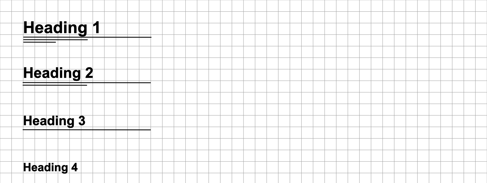
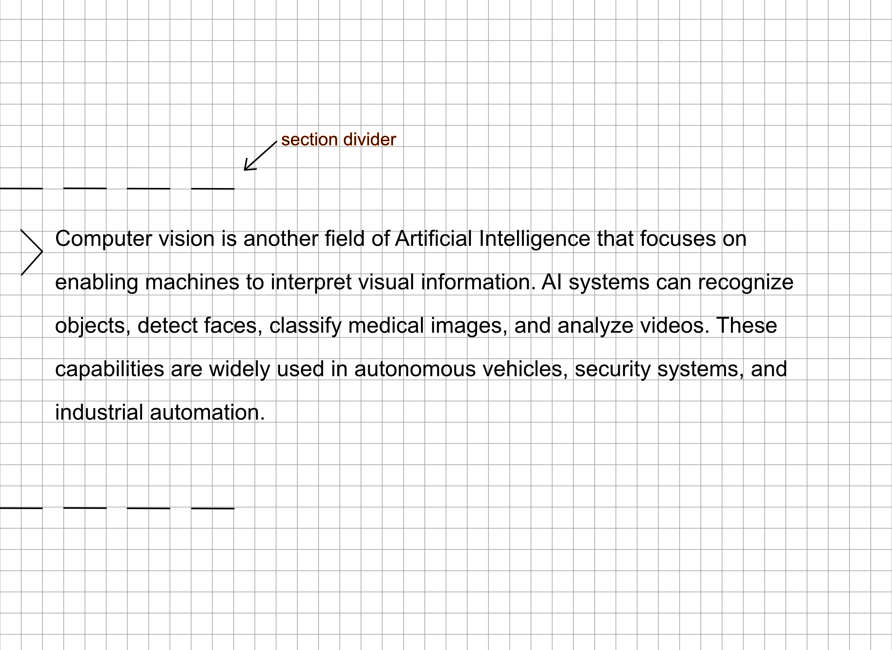

Hasta ahora, hemos visto cómo Gray Notation utiliza símbolos para organizar la información a nivel "micro" (bloque por bloque). Sin embargo, para que un cuaderno sea verdaderamente legible, también necesitamos organizar la información a nivel "macro": **la estructura de la página**.

Esta sección detalla convenciones visuales para separar grandes bloques temáticos y establecer jerarquías de títulos utilizando únicamente tu bolígrafo, sin necesidad de recurrir a marcadores, colores o letras exageradamente grandes.

# Jerarquía de Títulos (Headings)

Para diferenciar visualmente un tema principal de un subtema, Gray Notation propone un sistema de subrayado progresivo. Esto permite que el ojo identifique rápidamente la estructura del documento al hojear las páginas.

> [!tip] 
> 
> Mantener un espaciado consistente (por ejemplo, dejar siempre un renglón en blanco o dos cuadros antes y después de un Heading 1 y 2) potenciará enormemente el efecto visual de esta jerarquía.

# Separadores de Sección

Durante una clase, es común que ocurran saltos radicales de tema, o que simplemente termine una clase y la siguiente comience en la mitad de la misma hoja.

Para evitar que la información de contextos distintos se mezcle visualmente, utilizamos el **Separador de Sección**.

Consiste en trazar una **línea discontinua o punteada** (- - - - -) horizontal que atraviese parte o la totalidad del ancho de la zona de escritura.

