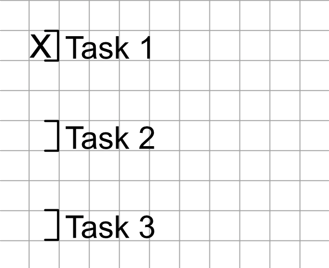
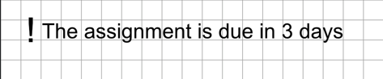
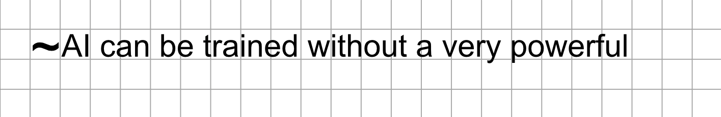

# Lista de Tareas 

Se usa el simbolo `]` para indicar una tarea 

# Recordatorio

Se usa el símbolo `!` para indicar que un texto a recordar

# Duda

Se usa el símbolo `~` para indicar que un texto es dudoso o no se tiene certeza clara de la afirmación.

